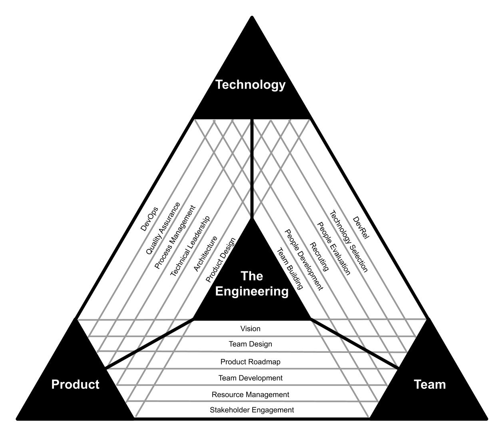

# 第1章：エンジニアリングマネージャーとは

## はじめに

あなたがこの本を手に取ったということは、エンジニアリングマネージャー（EM）という役割に興味を持っているか、すでにEMとして働いているのではないでしょうか。

多くの人が、シニアエンジニアからEMへとキャリアチェンジをした時、「エンジニアリングマネージャーとは何か」という根本的な問いに対する明確な答えを見つけるのに苦労します。コードを書くことが大好きだった私にとっても、マネジメントという新しい世界は、期待と不安が入り混じったものでした。

では、エンジニアリングマネージャーとは、どういう役割を持つ人でしょうか？
## 1.1 エンジニアリングマネージャーの定義

### エンジニアリングマネージャーとは何か

エンジニアリングマネージャーを一言で定義するなら、「技術チームの成功を通じて、ビジネス価値を創出する責任者」と言えるでしょう。しかし、この定義だけでは、EMの日々の仕事や求められるスキルセットを理解することはできません。

それに実際のところは、所属する企業の規模や置かれている環境によってその役割の範囲は変わる、としか言いようがありません。

ただ間違いなく言えるのは、リーダーシップとマネジメントのグラデーションであるということです。**リーダーシップとマネジメントは、一つのスキルセットとして捉えるのではなく、連携し合う2つの要素として捉えるべき**です。EMの役割は、この2つのバランスをとりながら、「技術」と「人」と「ビジネス」の交差点に立つことです。
### 3つのP：People、Process、Product

海外では、EMが参考にするフレームワークとして、「3つのP」があります。

このフレームワークのルーツは、1964年にハロルド・リービット（Harold Leavitt）が発表した論文「Applied Organization Change in Industry」にまで遡ります（※2）。リービットは当初、組織変革のための「ダイヤモンドモデル」として、People（人）、Structure（構造）、Tasks（タスク）、Technology（技術）の4要素を提唱しました。

その後、このモデルは進化し、StructureとTasksが「Process」として統合され、現在広く知られる「People、Process、Technology（PPT）」フレームワークとなりました。1990年代には、セキュリティ専門家のブルース・シュナイアー（Bruce Schneier）がこのフレームワークを情報セキュリティ業界で普及させました。

エンジニアリングマネジメントの文脈では、「Technology」が「Product」に置き換わり、「People、Process、Product」の3つのPとして定着しています：

**People（人）**
- チームメンバーの採用、育成、評価
- 1on1やフィードバックを通じた成長支援
- チーム文化の醸成と心理的安全性の確保
- キャリア開発とメンタリング

**Process（プロセス）**
- 開発プロセスの設計と改善
- アジャイル手法の導入と実践
- コミュニケーションフローの最適化
- 品質管理とリスク管理

**Product（プロダクト）**
- プロダクトビジョンの理解と伝達
- 技術的な意思決定
- ステークホルダーとの調整
- デリバリーの責任

優秀なEMは、これら3つの領域をバランスよく管理し、状況に応じて重点を変えることができます。
### Engineering Management Triangle

国内ではエンジニアリングマネージャーの役割は、[Engineering Management Triangle](https://github.com/engineering-manager-meetup/engineering-management-triangle)（※4）が良く整理されています。

このフレームワークは、前述の「３つのP」モデルとの共通性があり、それぞれどのような役割が必要かが整理されています。

#### Product - Technology

プロダクトとテクノロジーの間にある空白には、プロダクトを作るための技術、そして技術からプロダクトアウトする過程、プロダクト運用が含まれます。

|         Role         |              Description              |
| :------------------: | :-----------------------------------: |
|    Product Design    | プロダクトのビジュアル的なデザインだけではなく、技術のデザインも含まれる。 |
|    Architecuture     |         プロダクトを構成するアーキテクチャ全般。          |
| Technical Leadership |          技術的側面からプロダクトをリードする。          |
|  Process Management  |    サービスインに至るまでのプロセスそのものをマネジメントする。     |
|  Quality Assurance   |    ニーズ、期待、要求にプロダクトが適合していることを保証する。     |
|        DevOps        |      運用と開発を親和させて、プロダクトをより良くしていく。      |

#### Team - Product

チームが作るプロダクトそのものからプロダクトと関係する組織まで多岐にわたります。

|          Role          |      Description       |
| :--------------------: | :--------------------: |
|         Vision         | 組織のビジョン、プロダクトのビジョンを語る。 |
|      Team Design       |    プロダクト組織を設計、構築する。    |
|    Product Roadmap     |    プロダクトの方向を明確にする。     |
|    Team Development    |  プロダクト組織改善、開発を行っていく。   |
|  Resource Management   |  ヒト、モノ、カネなどの資源を管理する。   |
| Stakeholder Engagement | ステークホルダーのエンゲージメントを高める。 |
#### Team - Product
チームが作るプロダクトそのものからプロダクトと関係する組織まで多岐にわたります。

|          Role          |      Description       |
| :--------------------: | :--------------------: |
|         Vision         | 組織のビジョン、プロダクトのビジョンを語る。 |
|      Team Design       |    プロダクト組織を設計、構築する。    |
|    Product Roadmap     |    プロダクトの方向を明確にする。     |
|    Team Development    |  プロダクト組織改善、開発を行っていく。   |
|  Resource Management   |  ヒト、モノ、カネなどの資源を管理する。   |
| Stakeholder Engagement | ステークホルダーのエンゲージメントを高める。 |

### 4つのP - より包括的な視点

しかし、実際のEMの仕事を見ていくと、3つのPだけでは説明しきれない部分があります。広木 大地氏がはEMのマネジメント領域を4つにカテゴリー化しており（※3）、より包括的にEMの役割を理解するのに役立ちます。

**1. ピープルマネジメント（People Management）**
- 個人とチームの成長に焦点
- 1on1、メンタリング、コーチング
- 心理的安全性の確保とチームの機能性向上
- 傾聴、フィードバック、チームダイナミクスの理解が重要

**2. テクノロジーマネジメント（Technology Management）**
- ソフトウェアの品質と技術的プラクティスに集中
- DevOps、ソフトウェアアーキテクチャ、開発手法の理解
- 開発効率の維持と潜在的バグの削減
- モニタリング、インフラ、システムパフォーマンスの知識が必要

**3. プロジェクトマネジメント（Project Management）**
- プロジェクトのスコープ、品質、コスト、タイムライン（SQCD）の管理
- 不確実性と依存関係の処理
- プロジェクトファシリテーションとチーム調整
- PMBOKやアジャイル/スクラムなどの手法を活用

**4. プロダクトマネジメント（Product Management）**
- 「何を作るか」「なぜ作るか」に焦点
- 市場理解とソフトウェア要件の把握
- 仮説検証と要件定義のスキル
- プロダクトマーケティング、セールス、ユーザー体験の理解を含む

これらの4つの領域は相互に関連しており、組織の特定の段階やニーズに基づいて、柔軟に知識を適用する必要があります。
#### 実際の適用と優先順位

重要なのは、これらの領域は相互に関連しており、バランスを取ることが必要だということです。しかし、実際のEMの仕事では、組織のフェーズに応じて4つのPの優先順位が変わります：

**スタートアップ期（〜20名）：**
- **ピープルマネジメント: 25%**
  - 少数精鋭のチーム作り
  - 創業メンバーのモチベーション維持
  - マルチスキル人材の採用
  
- **テクノロジーマネジメント: 35%**
  - 技術スタックの選定
  - MVPの迅速な開発
  - 技術的な基盤作り
  
- **プロジェクトマネジメント: 15%**
  - 最小限のプロセス
  - アジャイルな意思決定
  - 迅速なイテレーション
  
- **プロダクトマネジメント: 25%**
  - PMF（Product Market Fit）の探索
  - ユーザーフィードバックの収集
  - 機能の優先順位付け

**成長期（20〜100名）：**
- **ピープルマネジメント: 30%**
  - 採用プロセスの確立
  - チーム文化の醸成
  - キャリアパスの設計
  
- **テクノロジーマネジメント: 25%**
  - スケーラビリティの確保
  - 技術的負債の管理
  - 開発環境の整備
  
- **プロジェクトマネジメント: 25%**
  - プロセスの標準化
  - スプリント計画の精緻化
  - リリースサイクルの確立
  
- **プロダクトマネジメント: 20%**
  - ロードマップの策定
  - 複数プロダクトラインの管理
  - 市場ニーズの分析

**成熟期（100名〜）：**
- **ピープルマネジメント: 35%**
  - 組織開発と文化醸成
  - リーダー育成プログラム
  - パフォーマンス管理体系
  
- **テクノロジーマネジメント: 20%**
  - アーキテクチャガバナンス
  - 技術標準の策定
  - イノベーション推進
  
- **プロジェクトマネジメント: 30%**
  - 複数チーム間の調整
  - 大規模プロジェクトの管理
  - 効率化と最適化
  
- **プロダクトマネジメント: 15%**
  - 戦略的製品ポートフォリオ
  - 市場競争力の維持
  - 新規事業の探索

ただ、重要なポイントは「エンジニアリングマネージャーはこれらすべてを実施することを求められている」訳ではありません。前述のとおり、所属する企業の規模や置かれている環境によってその役割の範囲は変わります。

## 1.2 EMの役割と責任

ここまででなんとなくエンジニアリングマネージャーのことは分かりました。しかし、あなたは「リーダー」と「マネージャー」を混同しているかもしれません。

世にある殆どの会社には、「リーダー」や「マネージャー」というポジションが存在し、この2つを混同して使われることもしばしばあるように思います。「エンジニアリングマネージャー」の対局にある「リーダー」ポジションというとそれは「テックリード」にあたりますが、その違いについて整理してみましょう。
### テックリードとの違い

「テックリード」と「エンジニアリングマネージャー」の違いは、多くの組織で曖昧になりがちです。そして、この曖昧さが「プレイングマネージャー」という、ある種リスクをはらんだ選択を生み出すことがあります。

**テックリード（リーダー的役割）：**
- 技術的な意思決定の中心
- アーキテクチャ設計とコードレビュー  
- 技術的なメンタリング
- 手を動かしてコードを書くことも多い
- リーダーシップの本質は「信頼」

**エンジニアリングマネージャー（マネージャー的役割）：**
- 人事的な責任（採用、評価、昇進）
- 予算管理
- 組織横断的なコミュニケーション
- チームのパフォーマンス全体への責任・
- マネジメントの本質は「論理的思考」

### プロダクトマネージャーとの協働

EMとプロダクトマネージャー（PM）の関係は、製品開発の成功に不可欠です。理想的には、EMとPMは対等なパートナーとして協力します：

**PMの主な責任：**
- 何を作るか（What）
- なぜ作るか（Why）
- いつまでに必要か（When）

**EMの主な責任：**
- どのように作るか（How）
- 誰が作るか（Who）
- どれくらいの工数か（How much）

この役割分担は、お互いの専門性を尊重しながら、建設的な議論を可能にします。例えば、PMが提案する機能に対して、EMは技術的な実現可能性や必要なリソースについてフィードバックを提供します。

### チームの代表者として

EMの重要な役割の一つは、チームの代表者として組織内の様々なステークホルダーと連携することです：

**チームの声を届ける：**
- 開発現場の課題と改善提案
- 必要なリソースの要求と根拠の説明
- 技術的なリスクと機会の共有
- メンバーのキャリア希望と成長機会の調整

**組織の方針を伝える：**
- ビジネス戦略の背景と意図の説明
- 優先順位の変更理由の共有
- 組織変更の影響と対応策の提示
- 期待値とゴールの明確化

この「翻訳者」としての役割は、チームの生産性と満足度に直接影響します。メンバーが「なぜこの仕事をするのか」を理解し、経営層が「現場で何が起きているか」を把握することで、組織全体の調和が保たれます。

---

> **💡 Column: EMについてのよくある誤解と現実**
> 
> EMという役割には、多くの誤解がつきまといます。ここでは、代表的な4つの誤解を解きほぐしましょう。
> 
> **💻 誤解1：EMは技術から離れる**
> 
> → **現実：** 確かにコードを書く時間は減りますが、技術から完全に離れるわけではありません。むしろ、より幅広い視野で技術を見る必要があります。アーキテクチャの決定、技術選定、技術的負債の管理など、より戦略的な技術的決定に関わります。
> 
> **👑 誤解2：EMは偉い**
> 
> → **現実：** EMは、ICよりも「偉い」わけではありません。異なる役割と責任を持っているだけです。優秀な組織では、ICとマネジメントの両方にキャリアパスがあり、同等に評価されます。GoogleではPrincipal EngineerとDirectorが同等のレベルです。
> 
> **😴 誤解3：EMは楽な仕事**
> 
> → **現実：** EMの仕事は、異なる種類の困難さがあります。技術的な問題解決から、人間関係の問題解決へとシフトします。感情労働が増え、ストレスの種類も変わります。「コードが動かない」はデバッグで解決できますが、「チームが動かない」はもっと複雑です。
> 
> **🌟 誤解4：良いエンジニアは良いEMになる**
> 
> → **現実：** 技術的に優秀であることと、良いマネージャーであることは、異なるスキルセットです。多くの優秀なエンジニアが、マネジメントには向いていないことを発見し、ICに戻ります。これは失敗ではなく、自己認識の結果です。
> 
> これらの誤解を理解した上でEMの道を選ぶことが、後悔のないキャリア選択につながります。

---

## 1.3 CTOやVPoEとエンジニアリングマネージャーとの違い

経営層とEMの役割分担を理解することは、自分のキャリアパスを考える上でも重要です。多くのエンジニアが「将来はEMからCTOやVPoEになりたい」と漠然と考えますが、実はCTO、VPoE、EMはそれぞれ全く異なるスキルセットと責任範囲を持っています。

### CTO（Chief Technology Officer）の役割

**CTOはプロダクト開発に技術面から責務を持つ**役職です。

CTOと聞くと「技術のトップ」というイメージがあります。しかし実際は、会社のフェーズによって全く異なる仕事をしています。

**スタートアップのCTO：**
- 自らコードを書く（初期は筆頭エンジニア）
- 技術スタックの選定
- MVPの開発リード
- 技術的な実験と検証
- 「作る」ことに100%集中

私の知り合いのスタートアップCTOは、「朝から晩までコードを書いている。でもそれが楽しい」と言っていました。

**成長期のCTO：**
- アーキテクチャの大規模な設計
- 技術的負債の管理戦略
- 新技術の評価と導入判断
- エンジニアリング文化の確立
- 外部への技術ブランディング（登壇、執筆）

**成熟期のCTO：**
- 技術戦略の策定（3-5年スパン）
- R&D投資の判断
- 技術的なリスク管理
- CTOオフィスの運営
- 取締役会への技術報告

つまり、CTOは**「技術を使ってビジネスをどう成長させるか」**を考える役職です。

### VPoE（Vice President of Engineering）の役割

**VPoEはプロダクト開発に組織面から責務を持つ**役職です（※5）。

日本ではまだ馴染みが薄いかもしれませんが、エンジニア組織が50人を超えたあたりから必要になってくる役職です。

**VPoEの主な責任：**

🏢 **組織設計と運営：**
- エンジニアリング組織の構造設計
- チーム編成と再編成の判断
- 採用戦略と実行（年間採用計画）
- 組織文化の醸成と維持

💰 **予算とリソース管理：**
- エンジニアリング予算の策定と管理
- ツールやインフラへの投資判断
- 外注やコンサルタントの活用判断
- コスト最適化

**パフォーマンス管理：**
- 組織全体の生産性指標の設定と追跡
- デリバリープロセスの最適化
- 品質基準の設定と維持
- エンジニアリング metrics のダッシュボード管理

**ステークホルダー管理：**
- 経営陣との調整
- プロダクト部門との協働
- 他部門（営業、CS、法務等）との連携
- 投資家への説明（必要に応じて）

私が以前働いていた会社のVPoEは、「コードは一切書かない。でも、100人のエンジニアが最高のパフォーマンスを出せる環境を作るのが仕事」と言っていました。

### エンジニアリングマネージャーの位置づけ

**エンジニアリングマネージャーはVPoEの役割を細分化して担っている**と考えると分かりやすいです。

具体的な違いを表にまとめてみました：

| 観点 | CTO | VPoE | EM |
|------|-----|------|-----|
| **主な焦点** | 技術戦略 | 組織運営 | チーム運営 |
| **管理範囲** | 全社技術 | 全エンジニア組織 | 5-10人のチーム |
| **時間軸** | 3-5年 | 1-2年 | 3-6ヶ月 |
| **KPI例** | 技術革新度、特許数 | 組織生産性、離職率 | チーム velocity、個人成長 |
| **コーディング** | 0-20% | 0% | 0-30% |
| **会議の相手** | CEO、投資家、顧客 | CTO、他部門VP、EM陣 | チームメンバー、PM、他EM |
| **採用** | 最終面接、口説き | 採用戦略、承認 | 実務面接、評価 |

### キャリアパスの考え方

「じゃあ、EMからCTOやVPoEになるにはどうすれば？」

実は、これらは**別々のキャリアトラック**として考えた方が良いです。

**EM → VPoE のパス：**
1. Senior EM（複数チーム管理）
2. Director of Engineering（部門管理）
3. VPoE

必要なスキル：組織設計、予算管理、経営視点

**EM → CTO のパス：**
1. EM + 技術的な貢献（アーキテクチャ設計等）
2. Principal Engineer や Distinguished Engineer
3. CTO

必要なスキル：深い技術力、ビジョン構築力、外部発信力

なお、CTOの役割を細分化して担っているのはいわゆる**テックリード**と呼ばれる役職になります（※6）。テックリードは技術的な意思決定とハンズオンの実装を両立させる役割で、CTOが戦略を考え、テックリードが戦術を実行するという関係性です。

### 実際のところ、どう違うの？

ある日の各役職の1日を見てみましょう：

**CTOの1日：**
- 9:00 新技術検証のレビュー
- 10:00 取締役会の準備
- 13:00 大手顧客との技術ディスカッション
- 15:00 カンファレンス登壇の準備
- 16:00 R&D チームとのブレスト

**VPoEの1日：**
- 9:00 EM全体会議
- 10:30 採用候補者の最終面接
- 13:00 四半期計画のレビュー
- 15:00 CFOとの予算会議
- 16:00 組織サーベイの結果分析

**EMの1日：**
- 9:00 デイリースタンドアップ
- 9:30 1on1（メンバーA）
- 10:30 スプリントプランニング
- 13:00 コードレビュー
- 14:00 1on1（メンバーB）
- 15:00 採用面接
- 16:00 振り返り会

このように見ると、全く異なる仕事をしていることが分かります。

大切なのは、**どの役職が偉いとか優れているとかではなく、自分がどんな仕事で価値を発揮したいか**を考えることです。技術を極めたいならCTO方向、組織を作りたいならVPoE方向、人を育てたいならEMを極める、という選択肢があります。

## 1.4 エンジニアリングマネージャーに必要なスキルセット

### 技術的スキル

EMに必要な技術的スキルのレベルは、議論の多いトピックです。「EMはコードを書くべきか」という問いに対する答えは、組織やチームの規模によって異なります。

**最低限必要な技術的スキル：**
- システムアーキテクチャの理解
- 技術的トレードオフの評価能力
- コードレビューができるレベルの知識
- 新技術の評価と導入判断
- 技術的負債の理解と管理

ここで特に重要なのが「技術的負債」の管理です。Googleの研究者たちが発表したドキュメントによると、技術的負債は「一時的な解決策や短期的な判断によって生じた、長期的な技術的な問題や課題」と定義されます。EMは、これらを体系的に評価し、管理する能力が求められます。

**コードを書く時間の現実：**
多くのEMが直面する現実は、マネジメント業務が増えるにつれて、コードを書く時間が減少することです。チームが5人を超えると、実質的にコードを書く時間はほとんどなくなります。

しかし、これを「失う」と捉えるのではなく、EMとしての価値が「自分でコードを書くこと」から「チームの生産性を最大化すること」にシフトすると考えるべきでしょう。ある先輩EMが言っていた言葉を借りれば、「マネージャーとしてのスキルは、エンジニアとしてのスキルと同様に継続的な学習が必要」です。

### ソフトスキル

技術的スキル以上に重要なのが、ソフトスキルです。EMには以下のような多様なソフトスキルが求められます：

**コミュニケーション：**
- 明確で簡潔な文書作成
- プレゼンテーション能力
- アクティブリスニング
- 非暴力的コミュニケーション

**リーダーシップ：**
- ビジョンの設定と共有
- 動機付けとインスピレーション
- 委任と権限移譲
- 困難な決定を下す勇気

**感情知性（EQ）：**
- 自己認識と自己管理
- 他者への共感
- 関係性の構築
- コンフリクトの解決

**ファシリテーション：**
- 会議の効果的な運営
- 意見の収束と合意形成
- 問題解決のプロセス設計
- チーム内の対話促進

#### 心理的安全性の重要性

これらのソフトスキルの中でも、特に重要なのが「心理的安全性」を醸成する能力です。

心理的安全性とは、ハーバード大学のエイミー・エドモンドソン教授が提唱した概念で、**「チームメンバーが対人関係のリスクを取っても安全だと感じられる環境」**を指します。具体的には、失敗を報告したり、質問をしたり、新しいアイデアを提案したりすることで、恥ずかしい思いをしたり、罰を受けたりしないと信じられる状態です。

Googleが実施した「プロジェクト・アリストテレス」の研究では、心理的安全性が**チームの生産性を左右する最も重要な要素**であることが明らかになりました。心理的安全性が高いチームでは：

- **ミスを恐れずに挑戦できる** - 失敗から学習する文化が生まれる
- **質問や相談がしやすい** - 問題の早期発見と解決につながる
- **多様な意見が出る** - イノベーションが生まれやすい
- **助け合いが自然に起こる** - チーム全体のパフォーマンスが向上する

EMとして心理的安全性を高めるためには、自ら失敗を共有したり、「わからない」と言える環境を作ったり、メンバーの意見に真摯に耳を傾けたりすることが重要です。これらのスキルは、チームのパフォーマンスを最大限に引き出すための環境を提供し、相互のコミュニケーションにおけるあらゆる障壁を排除することにつながります。

### ビジネススキル

EMは、技術とビジネスの橋渡し役でもあります。エンジニアとしてのバックグラウンドを持つ多くのEMにとって、ビジネススキルの習得は新たな挑戦となりますが、組織への影響力を高めるために不可欠です。

**財務管理：**
- **予算策定と管理** - チームの人件費、ツール、インフラコストの見積もりと追跡
- **ROI（投資収益率）の計算** - 新技術導入や人員増強の正当化
- **TCO（総所有コスト）の理解** - 技術選定時の長期的コスト評価
- **コスト最適化** - クラウドコスト、ライセンス費用の削減提案

例えば、新しい開発ツールの導入を提案する際、「生産性が上がります」では不十分です。「月額3万円のツール導入により、開発時間が20%短縮され、年間で500万円相当の工数削減が見込める」といった具体的な数値で説明する必要があります。

**プロジェクト管理：**
- **スコープ管理** - 要件の明確化と変更管理
- **リスク評価と軽減策** - 技術的・組織的リスクの特定と対処
- **ステークホルダー管理** - 期待値の調整と進捗報告
- **リソース配分** - チームメンバーの適材適所とワークロード管理

プロジェクト管理では、アジャイルとウォーターフォールの良いところを組み合わせる柔軟性が求められます。スプリントでの開発を行いながら、経営層には四半期単位でのロードマップを提示するといった「二階建て」の管理が必要です。

**データドリブンな意思決定：**
- **メトリクスの設定と追跡** - チームの生産性、品質、満足度の定量化
- **A/Bテストとデータ分析** - 施策の効果測定と改善
- **ダッシュボード設計** - 経営層向けとチーム向けの可視化
- **トレンド分析** - 過去データからの学習と予測

「勘と経験」だけでなく、データに基づいた意思決定が求められます。例えば、「コードレビューに時間がかかりすぎている」という感覚を、「PRのマージまでの平均時間が3日から5日に増加」という具体的なデータで示すことが重要です。

**戦略的思考：**
- **長期的視点** - 3ヶ月、1年、3年後を見据えた技術戦略
- **競合分析** - 他社の技術動向と自社の差別化ポイント
- **ビジネスモデルの理解** - 収益構造と技術の貢献方法
- **イノベーションの推進** - 新技術の評価と実験的導入

戦略的思考は、日々のタスクに忙殺されがちなEMにとって特に重要です。「今日の火消し」だけでなく、「将来の火事を防ぐ仕組み」を考える時間を確保する必要があります。

**交渉とプレゼンテーション：**
- **Win-Winの交渉術** - リソース獲得や期限調整での建設的な対話
- **エグゼクティブ向けプレゼン** - 技術的詳細を省いた要点の伝達
- **ストーリーテリング** - データと物語を組み合わせた説得力のある説明
- **異なる聴衆への適応** - エンジニア、PM、経営層それぞれに合わせた伝え方

これらのビジネススキルは一朝一夕では身につきません。しかし、技術的な強みとビジネス感覚を併せ持つEMは、組織にとって非常に価値の高い存在となります。

## 1.5 ICからEMへのキャリアパス

### なぜEMになるのか

Individual Contributor（IC）からEMへの転身を考える理由は人それぞれです。

**健全な動機：**
- 人を育てることに喜びを感じる
- チーム全体の成果を最大化したい
- 技術とビジネスの橋渡しをしたい
- より大きな影響力を持ちたい
- 組織の問題を解決したい

**再考すべき動機：**
- 給与が上がるから
- 昇進の唯一の道だから
- コードを書くのに飽きたから
- 権力が欲しいから

### プレイングマネージャーという選択肢

多くの組織、特に小規模なチームやスタートアップでは、「プレイングマネージャー」という選択肢が生まれます。これは、マネジメント業務をしながら実装も行う役割です。

**プレイングマネージャーが生まれる背景：**
- **リソース不足** - 組織はマネジメント能力を要求しつつ、現場のリソースも求める
- **技術的信頼の維持** - コードを書き続けることでチームからの技術的信頼を保つ
- **実務への情熱** - 優秀な技術者がマネジメントに移行しても手を動かし続けたい
- **段階的な移行** - いきなり完全なマネージャーになることへの不安

**プレイングマネージャーの現実：**

**魅力的に見える面：**
- 技術的な信頼を維持しながらチームを導ける
- 現場の課題を肌感覚で理解できる
- メンバーと同じ目線で仕事ができる
- 採用コストを抑えられる（組織視点）

**隠れた落とし穴：**
- **時間の分断** - コーディングとマネジメントの切り替えで生産性が低下
- **成長の停滞** - どちらのスキルも中途半端になりがち
- **バーンアウトリスク** - 二重の責任によるストレス増大
- **判断の歪み** - 技術的な興味と組織の優先順位の衝突
- **チームへの悪影響** - 自分がコードを書くことで、メンバーの成長機会を奪う可能性

ある先輩EMの言葉を借りれば、「プレイングマネージャーは短距離走。長期戦になると必ず破綻する」のです。

**プレイングマネージャーを選択する場合の戦略：**

もしプレイングマネージャーを選択するなら、以下の点を明確にすることが重要です：

1. **期限を決める** - 6ヶ月〜1年の移行期間として位置づける
2. **コーディング時間を制限** - 週20%以下に抑える
3. **役割を明確化** - 緊急度の高いタスクや、誰も解決できない技術的課題のみ自分で実装
4. **定期的な見直し** - 3ヶ月ごとに役割配分を再評価
5. **引き継ぎの準備** - 自分が書いたコードを他のメンバーが保守できるようにする

多くのEM経験者が口を揃えて言うのは、「**まずはマネジメントスキルを着実に身につけること**」です。技術力は後からでも取り戻せますが、マネジメントの基礎を疎かにすると、チーム全体に影響が及びます。

### 移行期の課題

ICからEMへの移行は、多くの課題を伴います：

**アイデンティティの変化：**
優秀なエンジニアであることがアイデンティティの核だった人にとって、コードを書かなくなることは大きな喪失感を伴います。「自分の価値は何か」という問いと向き合う必要があります。

**成果の測定方法の変化：**
ICとしては、書いたコードの量や品質で成果を測ることができました。しかし、EMの成果は間接的で、測定が困難です。チームの成功が自分の成功となります。

**時間管理の複雑化：**
会議が増え、割り込みが頻繁になり、深い集中時間を確保することが困難になります。新しい働き方を学ぶ必要があります。

### 成功のための戦略

**段階的な移行：**
可能であれば、いきなりフルタイムのEMになるのではなく、テックリードやチームリードとして経験を積むことを推奨します。

**メンターの確保：**
経験豊富なEMをメンターとして持つことは、非常に価値があります。社内外でメンターを見つけ、定期的にアドバイスを求めることを推奨します。

**継続的な学習：**
マネジメントスキルは、技術スキルと同様に継続的な学習が必要です。書籍、ポッドキャスト、カンファレンス、コミュニティなど、学習リソースを活用することが重要です。

---

> **📅 Column: EMの一日 - ある火曜日の記録**
> 
> EMの仕事は実際どんなものなのか？ある典型的な火曜日を追ってみましょう。
> 
> **9:00 - 9:30 📧 デジタルコミュニケーションの整理**
> メールとSlackをチェック。夜間アラート（幸い軽微）、チームからの質問3件、ステークホルダーからのリクエスト2件。優先順位をつけて、緊急のものから返信。
> 
> **9:30 - 10:00 🏃 スタンドアップミーティング**
> チーム全員で進捗確認。新人エンジニアがDBマイグレーションで詰まっていることが判明。シニアエンジニアにサポートを依頼。
> 
> **10:00 - 11:00 👥 1on1（シニアエンジニアと）**
> 「テックリードへの興味がある」という相談。キャリアパスについて30分議論し、残り30分で現在のプロジェクトの技術的課題を深掘り。
> 
> **11:00 - 12:00 🎯 採用面接**
> バックエンドエンジニア候補の技術面接。システム設計の質問で良い議論ができた。採用委員会に「Strong Hire」で推薦することに。
> 
> **13:00 - 14:00 🗺️ プロダクトロードマップミーティング**
> PMと次四半期の計画を議論。新機能3つのうち、2つは現実的だが、1つは工数的に厳しいことを説明。代替案を提示。
> 
> **14:00 - 14:30 🌱 1on1（ジュニアエンジニアと）**
> 入社3ヶ月の振り返り。「コードレビューが怖い」という本音を聞き出せた。心理的安全性の話をして、具体的な改善策を一緒に考える。
> 
> **14:30 - 15:30 🏗️ アーキテクチャレビュー**
> マイクロサービス分割の設計レビュー。トレードオフを整理し、段階的移行のアプローチで合意。ドキュメント化をお願い。
> 
> **15:30 - 16:00 💰 予算ミーティングの準備**
> 来年度の採用計画とツール投資の資料作成。「なぜ3人必要か」を数値で説明できるよう、過去の生産性データを分析。
> 
> **16:00 - 17:00 🤝 ステークホルダーとの定例**
> セールスチームから「この機能いつできる？」の質問。現実的なタイムラインを説明し、早期リリースのための妥協案を探る。
> 
> **17:00 - 18:00 📝 ドキュメント作成と明日の準備**
> パフォーマンスレビューの下書き、新しいオンコールローテーションの文書化。明日の全社会議のスライドを最終確認。
> 
> **🔄 この日のコンテキストスイッチ：15回**
> 
> 技術的な議論から人事的な相談、予算計画から採用面接まで、EMの一日は多様性に富んでいます。深いコーディング時間は取れませんが、チーム全体に影響を与える意思決定を次々と行っています。
> 
> 疲れる？はい。
> やりがいがある？間違いなく、はい。
> 
> これがEMの日常です。毎日が違い、予測不可能で、だからこそ面白いのです。

---

## 1.8 EMとしての成功指標

### チームの成功指標

EMの成功は、主にチームの成功を通じて測られます：

**定量的指標：**
- デリバリーの予測可能性（計画通りの納期達成率）
- 品質指標（バグ率、インシデント数）
- 生産性指標（ベロシティ、サイクルタイム）
- チームの成長（メンバーの昇進、スキル向上）

**定性的指標：**
- チームの満足度とエンゲージメント
- 心理的安全性のレベル
- イノベーションと実験の文化
- ステークホルダーからの信頼

### 個人の成功指標

EMとしての個人的な成功も重要です：

**スキル開発：**
- リーダーシップスキルの向上
- 技術的知識の維持と更新
- ビジネス理解の深化
- ネットワークの拡大

**インパクト：**
- 組織への貢献度
- メンバーの成長への貢献
- プロセス改善の成果
- イノベーションの推進

### 長期的なキャリア成功

EMとしてのキャリアを長期的に成功させるためには：

**持続可能性：**
- ワークライフバランスの維持
- バーンアウトの防止
- 継続的な学習習慣
- サポートネットワークの構築

**キャリアオプション：**
- シニアEM、ディレクターへの昇進
- 専門領域（採用、品質、インフラ）への特化
- ICへの復帰（アーキテクト、プリンシパルエンジニア）
- 起業やコンサルティング

## まとめ

エンジニアリングマネージャーという役割は、挑戦的であると同時に、非常にやりがいのあるものです。技術的な専門性を基盤としながら、人とプロセスとプロダクトをマネジメントし、チームとして大きな成果を生み出すことができます。

EMになることは、キャリアの終着点ではなく、新しい学習と成長の始まりです。この章で述べた役割と責任を理解し、必要なスキルを開発し、現実的な期待を持つことで、成功への第一歩を踏み出すことができるでしょう。

次章では、強いエンジニアリングチームを構築するための具体的な方法について詳しく見ていきます。チームビルディングは、EMの最も重要な仕事の一つであり、すべての成功の基盤となるものです。

## EMになるための準備チェックリスト

ICからEMへの転身を検討している方、またはEMになりたての方のためのチェックリストです：

### 1. 自己評価 - EMになる準備はできているか？
- [ ] 人を育てることに喜びを感じる
- [ ] 技術的な問題より組織的な問題解決に興味がある
- [ ] コードを書く時間が減っても受け入れられる
- [ ] 感情労働（他者の感情に配慮する仕事）に耐えられる
- [ ] 会議やコミュニケーションが苦にならない

### 2. 現在のスキル評価
- [ ] **技術スキル** - システム設計や技術選定ができる
- [ ] **コミュニケーション** - 明確で簡潔な文書作成・プレゼンができる
- [ ] **リーダーシップ** - チームを導いた経験がある（公式・非公式問わず）
- [ ] **ビジネス理解** - ROIや予算の基礎知識がある
- [ ] **感情知性** - 他者の感情を理解し、適切に対応できる

### 3. 組織の理解と調整
- [ ] 自社でのEMの役割と責任範囲を理解している
- [ ] CTO/VPoE/テックリードとの違いを理解している
- [ ] 上司（将来の上司）とEMへの期待値を確認した
- [ ] PMやステークホルダーとの協働方法を理解している
- [ ] 現在のチームのEMになる場合、メンバーとの関係性の変化を理解している

### 4. 学習計画の策定
- [ ] マネジメントに関する基礎書籍を3冊以上読んだ
- [ ] 1on1やフィードバックの手法を学んだ
- [ ] アジャイル/スクラムの基本を理解している
- [ ] 心理的安全性とチームビルディングについて学んだ
- [ ] 6ヶ月間の学習ロードマップを作成した

### 5. メンタリングとサポート
- [ ] 社内外でEMのメンターを見つけた（または探している）
- [ ] EMコミュニティやMeetupを調査した
- [ ] 同じ立場の仲間（ピアグループ）を見つけた
- [ ] 定期的に相談できる相手がいる
- [ ] 失敗を共有できる心理的に安全な環境がある

### 6. プレイングマネージャーとしての戦略（該当する場合）
- [ ] プレイングマネージャーの期限を決めた（最長1年）
- [ ] コーディング時間を週20%以下に制限する計画がある
- [ ] 自分が担当するコードの引き継ぎ計画がある
- [ ] マネジメント業務の優先順位を明確にした
- [ ] 3ヶ月ごとの役割見直しタイミングを設定した

### 7. 移行期の準備
- [ ] 現在のタスクの引き継ぎ計画を作成した
- [ ] 新しい時間管理方法を検討した（カレンダーブロッキング等）
- [ ] 会議の増加に対応する準備ができている
- [ ] ICとしてのアイデンティティの変化を受け入れる準備がある
- [ ] 成果の測定方法が変わることを理解している

このチェックリストで7割以上チェックがついたら、EMへの転身を前向きに検討できる段階です。すべてにチェックがつく必要はありません。EMになってから学ぶことも多くあります。大切なのは、継続的に成長する意欲と、チームのために尽くす覚悟です。

---

**参考文献 / 補足：**

※1. オライリー・ジャパン「エンジニアリングマネージャーのしごと」には、エンジニアリングマネージャーの定義は記載されていません。本当に「しごと」しか書いてありません。

※2. Leavitt, H. J. (1964). "Applied Organization Change in Industry: Structural, Technical, and Human Approaches." リービットのダイヤモンドモデルは、組織変革の基礎理論として、現在のPPTフレームワークの基礎となっています。

※3. hirokidaichi (2018). [エンジニアリングマネージャーのしごと](https://qiita.com/hirokidaichi/items/95678bb1cef32629c317). Qiita. エンジニアリングマネージャーの4つのマネジメント領域（ピープル、テクノロジー、プロジェクト、プロダクト）について詳細に解説。

※4. [Engineering Management Triangle](https://github.com/engineering-manager-meetup/engineering-management-triangle). エンジニアリングマネージャーの役割を体系的に整理したフレームワーク。

※5. VPoE (Vice President of Engineering) は組織全体のエンジニアリング戦略を担当し、EMは個々のチームレベルでその戦略を実行します。

※6. CTOの役割を細分化して担っているのはいわゆるテックリードと呼ばれる役職になります。技術的な意思決定とアーキテクチャ設計に焦点を当てます。